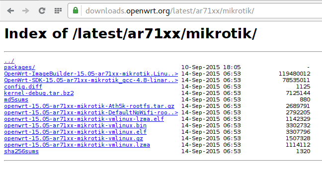

Начну установку с установки ОпенВРТ на МетаРоутер. У меня под рукой hex-lite и буду описывать процесс установки под него. В разделе downloads офсайта есть [образ]:[downloadopenwrt]

[downloadopenwrt]: https://downloads.openwrt.org/latest/ar71xx/mikrotik/openwrt-15.05-ar71xx-mikrotik-DefaultNoWifi-rootfs.tar.gz

