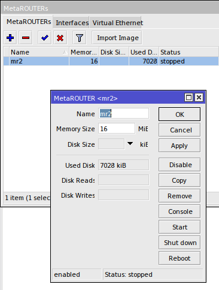
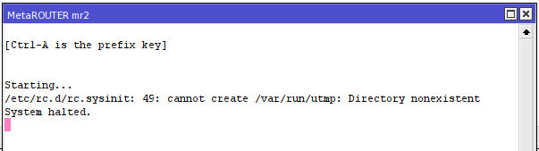

Начну установку с установки ОпенВРТ на МетаРоутер.

>! У меня под рукой hex-lite и буду описывать процесс установки под него. В разделе downloads офсайта есть [образ][downloadopenwrt]
>! 
>! 
>! 
>! И попробую закинуть `scp openwrt-15.05-ar71xx-mikrotik-DefaultNoWifi-rootfs.tar.gz eri@192.168.236.1:/flash/` . Drag'n'Drop в Wine работает всё хуже и хуже, сейчас многие действия делаю по ssh - очень универсальный протокол ;) Путь к папке flash в данном роутере важен потому что основную память у него урезали до 16МБ. Первая загрузка у меня не получилась как раз из-за недостачного места. 
>! 
>! 
>! 
>! И опять не влез... в этом пакете много ненужного - попробую почистить вручную, но вам не рекомендую этим заниматься - лучше [пересобрать][building_openwrt.md]. Всё - забудте о hex-lite. На нем нет места чтоб минималку установить без проблем. Перемещаюсь на роутер, который немного далеко от меня - на 750UP.
>! 
>! 
>! Распаковалось и образ можно теперь удалить.
>! 
>! 
>! Ну вот те и раз...
>! 

[downloadopenwrt]: https://downloads.openwrt.org/latest/ar71xx/mikrotik/openwrt-15.05-ar71xx-mikrotik-DefaultNoWifi-rootfs.tar.gz

