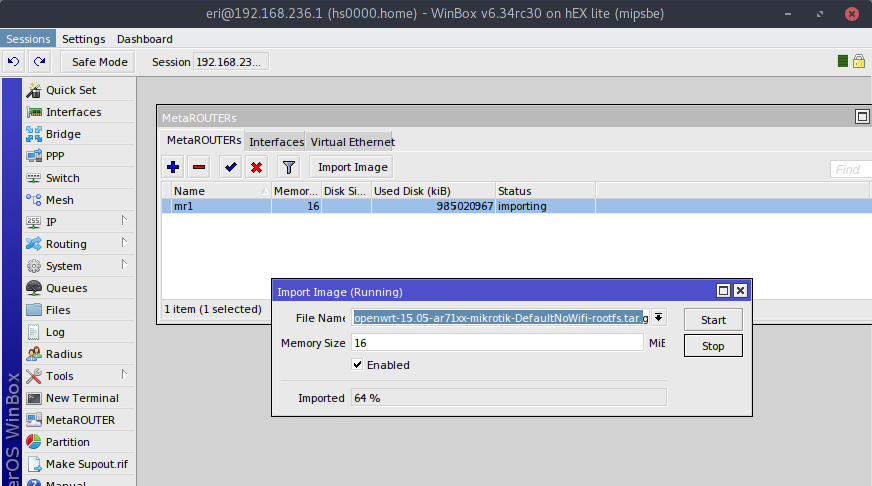

Начну установку с установки [ОпенВРТ на МетаРоутер](https://wiki.openwrt.org/inbox/doc/mikrotik_metarouter_openwrt).
Есть сборки [AA у чехов](http://openwrt.wk.cz/trunk/mr-mips/) и [AA у немцев](http://download.bmsoft.de/mikrotik/12.09/metarouter/mr-mips/). Вот [BB от других немцев](http://openwrt.naberius.de/barrier_breaker/mr-mips/)

 

Запустить CC без переделки не получилось

>У меня под рукой hex-lite и буду описывать процесс установки под него. В разделе downloads офсайта есть [образ][downloadopenwrt]
>
>
>
>И попробую закинуть `scp openwrt-15.05-ar71xx-mikrotik-DefaultNoWifi-rootfs.tar.gz eri@192.168.236.1:/flash/` . Drag'n'Drop в Wine работает всё хуже и хуже, сейчас многие действия делаю по ssh - очень универсальный протокол ;) Первая загрузка у меня не получилась как раз из-за недостачного места. 
>
>
>
>И опять не влез... в этом пакете много ненужного - попробую почистить вручную, но вам не рекомендую этим заниматься - лучше [пересобрать][building_openwrt.md]. Всё - забудте о hex-lite. На нем нет места чтоб минималку установить без проблем. Перемещаюсь на роутер, который немного далеко от меня - на 750UP.
>
>
>Распаковалось и образ можно теперь удалить.
>
>
>Ну вот те и раз...
>

[downloadopenwrt]: https://downloads.openwrt.org/latest/ar71xx/mikrotik/openwrt-15.05-ar71xx-mikrotik-DefaultNoWifi-rootfs.tar.gz

